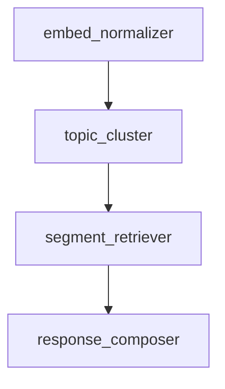

# 📦 QAT Tool Modules Specification

@template-version: 2.1.0
@field-mode: strict+inferred
@ai-role: subroutine-logic
@used-by: \[tool.name.here]
@ai-generated: true
@human-reviewed: false

---

## 🧠 Module Graph Overview

> This file defines all internal logic blocks used by a single QAT tool. Modules should represent named, ordered subroutines with clean IO separation.
> Each module is composable, optionally reusable, and contributes to the full transformation path of the tool.

---

### 📄 Module Index

| ID                  | Type         | Description                                | Order |
| ------------------- | ------------ | ------------------------------------------ | ----- |
| `embed_normalizer`  | `transform`  | Normalize input embeddings to shared scale | 1     |
| `topic_cluster`     | `analyze`    | Cluster semantically similar vectors       | 2     |
| `segment_retriever` | `dispatch`   | Pull context-relevant file slices          | 3     |
| `response_composer` | `synthesize` | Generate readable summary from findings    | 4     |

---

## 🔧 Module Definitions

### 🧩 `embed_normalizer`

* **Type**: `transform`
* **Description**: Converts raw embedding vectors to a normalized format. Standardizes length, scale, and type to enable cluster analysis.
* **Inputs**:

  * `embeddings`: `List[List[float]]` — Raw vector data
* **Outputs**:

  * `normalized_embeddings`: `List[List[float]]`
* **Order**: `1`
* **Optional Notes**:

  * Uses `qat_struct.embedding_set` schema
  * Triggers warning if `nan` values exceed threshold

---

### 🧩 `topic_cluster`

* **Type**: `analyze`
* **Description**: Groups normalized embeddings into conceptual clusters based on cosine similarity and topic inference.
* **Inputs**:

  * `normalized_embeddings`: `List[List[float]]`
* **Outputs**:

  * `cluster_map`: `Dict[str, List[int]]`
* **Order**: `2`
* **Heuristics**:

  * `min_cluster_size`: 5
  * `max_topic_overlap`: 0.3

---

### 🧩 `segment_retriever`

* **Type**: `dispatch`
* **Description**: Retrieves segments from source files that align with clustered topics or high-similarity points.
* **Inputs**:

  * `cluster_map`: `Dict[str, List[int]]`
  * `fileset`: `List[FileBlob]`
* **Outputs**:

  * `context_segments`: `List[SegmentSummary]`
* **Order**: `3`
* **Fallback Logic**:

  * If cluster map is empty, use embedding proximity alone

---

### 🧩 `response_composer`

* **Type**: `synthesize`
* **Description**: Generates a human-readable Markdown summary or JSON block from matched segments.
* **Inputs**:

  * `context_segments`: `List[SegmentSummary]`
* **Outputs**:

  * `summary`: `str`
  * `rationale_map`: `Dict[str, str]`
* **Order**: `4`
* **Codex Tip**:

  * Avoid LLM hallucination by quoting sources when available
  * May emit `DriftSignal` if summary coverage is low

---

## 🪞 Module Reflex Flags (Optional)

> Flags used by Codex/Fork Agents to trigger secondary logic, auto-reflection, or debug paths.

| Module              | Reflex Trigger           | Action                           |
| ------------------- | ------------------------ | -------------------------------- |
| `topic_cluster`     | `cluster_drift_detected` | Emit `DriftSignal` → audit queue |
| `response_composer` | `summary_conflict`       | Fork to `intent.rewrite.path`    |

---

## 🧱 Schema Reference

> All inputs/outputs should resolve to entries in `qat_struct.md`, where applicable.
> Types like `FileBlob`, `SegmentSummary`, `DriftSignal` must have known structures for Codex compatibility.

---

## 🧩 Assembly Logic (Optional)

---

## 📌 Design Notes

* Modules should be idempotent where possible.
* Use clear naming: `verb_object` or concept nouns.
* Allow module invocation from chat context (e.g., “run topic\_cluster manually”).
* Avoid chaining into unrelated toolsets unless explicitly defined in `qat_toolkit`.

---

## ✅ Module Integrity Checklist

* [x] All modules have unique IDs
* [x] All IO types are defined
* [x] Order is consistent with pipeline path
* [x] Reflex triggers mapped
* [x] Fallback paths provided for noncritical modules
