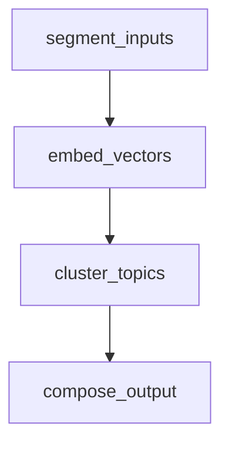

# 🧩 QAT Tool Modules Template (v2.2 Final)

```yaml
@template-version: 2.2
@format-type: template
@ai-role: modules.subroutine_graph
@field-mode: strict+inferred
@ai-generated: true
@human-reviewed: true
@description: Describes internal logic graph of tool; each module is atomic, composable, and reflex-aware.
```

---

## 🧠 Module Graph Overview

> This section defines the logic graph of a tool as discrete, independently testable logic components ("modules").
> Each module:
>
> * has a clear transformation or reasoning goal,
> * defines typed IO fields, and
> * participates in execution order or reflex reentry.

---

## 📋 Module Index

| ID (`module_id`) | Type         | Description                        | Order |
| ---------------- | ------------ | ---------------------------------- | ----- |
| `segment_inputs` | `transform`  | Cleans and chunks source input     | 1     |
| `embed_vectors`  | `analyze`    | Maps chunks to embedding space     | 2     |
| `cluster_topics` | `synthesize` | Groups embeddings into topic nodes | 3     |
| `compose_output` | `transform`  | Builds structured result package   | 4     |

> 🔧 Types: `transform`, `analyze`, `filter`, `synthesize`, `dispatch`, `fork`, `visualize`

---

## 🔧 Module Definitions (Verbose & Executable Guidance)

> 🧠 Treat each module like a micro-program.
> The `description` field must answer:
>
> * What does this module do?
> * How does it use the inputs?
> * What logic gates or transformations does it apply?
> * What shape is the output, and why?

Use the following pattern:

---

### 🧩 `segment_inputs`

```yaml
type: transform
description: |
  Takes `input_text` (plain text or markdown) and splits it into semantically meaningful blocks for downstream embedding. 
  Applies heuristic rules such as:
  - Prefer paragraph boundaries and double newlines
  - Soft maximum token size (default = 512)
  - If no clean break found, fallback to `newline_split`
  Output is a list of `Segment` objects, each with:
  - `text`: the raw content block
  - `token_count`: estimated size
  - `source`: original filename if inferred from `fileset`
order: 1
inputs:
  - input_text: string — the full text to segment
  - params.chunk_size: int — optional override for token limit
outputs:
  - segments: List[Segment] — token-aligned content blocks
notes:
  heuristics: [soft_limit=512, fallback="newline_split"]
  flags: [skip_if_empty]
```

---

### 🧩 `embed_vectors`

```yaml
type: analyze
description: |
  For each item in `segments`, compute a vector embedding using the model specified in `params.embedding_model`.
  The `Segment.text` is passed into the embedding API or function.
  Embedding is skipped if:
  - segment length < 5 tokens
  - segment marked `skip=true`
  Output is a list of `Embedding` objects, each with:
  - `vector`: array[float]
  - `source_id`: maps to the segment index
  Emits `DriftSignal` if total embeddings fall below expected threshold or average similarity is under 0.5.
order: 2
inputs:
  - segments: List[Segment]
  - params.embedding_model: string — e.g., "text-embedding-ada-002"
outputs:
  - vector_set: List[Embedding]
notes:
  flags: [emits_drift_signal]
```

---

### 🧩 `cluster_topics`

```yaml
type: synthesize
description: |
  Performs K-means-like topic grouping on the `vector_set`. Uses cosine similarity to identify natural clusters.
  Heuristics:
  - Optimal cluster count = sqrt(N) where N = number of vectors
  - Discard clusters with < 2 members unless override is active
  Output is a list of `TopicBlock` entries:
  - `topic_name`: label generated from top keywords
  - `segment_ids`: list of source Segment indices
  - `centroid`: average vector
  Warns if no clear cluster structure found. May trigger reflex fallback.
order: 3
inputs:
  - vector_set: List[Embedding]
outputs:
  - topic_clusters: List[TopicBlock]
notes:
  heuristics: [cluster_method=cosine, min_size=2]
```

---

### 🧩 `compose_output`

```yaml
type: transform
description: |
  Assembles final output from `topic_clusters` and matching `segments`.
  Steps:
  1. For each cluster, retrieve `Segment.text` entries
  2. Generate `summary` using top terms and a language model prompt
  3. Build `AnalysisBlock[]` that contains:
     - `topic`, `excerpt_list`, and optional `citation_map`
  Final `raw_output` is a dict suitable for Codex/CodexTool execution.
  Summary is human-facing Markdown with section headers for each topic.
  Handles max output length by truncating with ellipsis.
order: 4
inputs:
  - topic_clusters: List[TopicBlock]
  - segments: List[Segment]
outputs:
  - summary: string — user-facing report
  - results: List[AnalysisBlock] — machine-usable output
  - raw_output: dict — full payload
notes:
  flags: [final_output=true, codex_safe=true]
```

---

### 📌 Writing Guidelines for Descriptions

| Element            | Guideline                                                         |
| ------------------ | ----------------------------------------------------------------- |
| Start with verb    | “Builds…”, “Analyzes…”, “Filters…”                                |
| Use numbered steps | Prefer `1.`, `2.`, `3.` format to convey logic order              |
| Be IO-explicit     | Reference inputs directly: “uses `segments` to…”                  |
| Emit structure     | Mention shape and type of all outputs: `List[TopicBlock]`, `dict` |
| Conditional logic  | State fallback or conditional branches if applicable              |
| Trust LLM parsing  | Avoid idioms or ambiguity — descriptions may be used as code seed |

---

Would you like me to integrate this directly into the canvas version of the modules template, or generate a new filled-out `.modules.md` file for a real tool (e.g., `concept_merger`)?


---

## 🪞 Module Reflex Triggers (Optional)

| `module_id`      | Reflex Trigger Condition    | Reflex Action                      |
| ---------------- | --------------------------- | ---------------------------------- |
| `embed_vectors`  | no output or vector drift   | emit `DriftSignal`                 |
| `cluster_topics` | fewer than 2 valid clusters | rerun `segment_inputs` w/ fallback |
| `compose_output` | missing `summary`           | downgrade mode to `reflect`        |

---

## 🧱 Schema Reference

| Custom Type     | Used In Module(s) |
| --------------- | ----------------- |
| `Segment`       | `segment_inputs`  |
| `Embedding`     | `embed_vectors`   |
| `TopicBlock`    | `cluster_topics`  |
| `AnalysisBlock` | `compose_output`  |

> ⚠️ These types must exist or be referenced in `qat_struct.md`.

---

## 🧩 Assembly Graph (Optional)



---

## 🧠 Design Hints for ToolSmith Agents

| Principle             | Practice                                                           |
| --------------------- | ------------------------------------------------------------------ |
| Single Responsibility | Modules should do one atomic task (e.g., "map", "rank", "cluster") |
| Clear IO Contracts    | Inputs/outputs should match `qat_struct.md` types                  |
| Reflex Compatible     | Modules should emit fallback triggers as needed                    |
| Name Verbosely        | Prefer `cluster_topics` to `cluster` or `stage_3`                  |
| Order is Explicit     | Do not assume sort order; define `order:` field                    |
| Composability         | Each module should be mockable for testing or CI                   |

---

## ✅ Module Completion Checklist

* [ ] Each module has unique `module_id`
* [ ] `inputs[]` and `outputs[]` are typed and documented
* [ ] Execution order is defined and correct
* [ ] Reflex triggers are declared if applicable
* [ ] All types are declared in `qat_struct.md`
* [ ] Mermaid diagram included if multi-stage

---

## 📎 Related

* Tool Spec: `tool.md`
* Struct Schema: `qat_struct.md`
* Reflex Config: `reflex.md` (optional)

---

## 📚 Metadata

```yaml
created: 2025-07-13
last_updated: 2025-07-13
tags: [tool-modules, execution-graph, modular]
```
